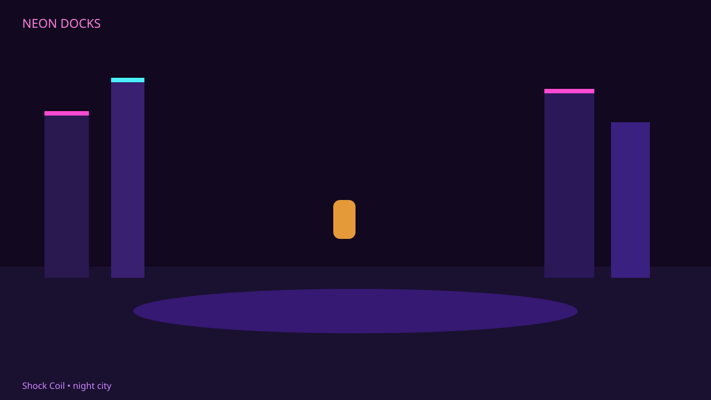
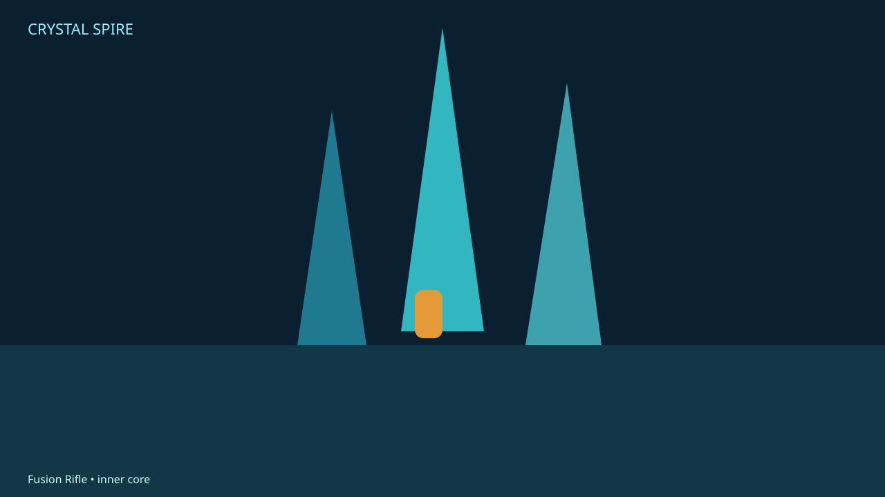

# Skybound: Riftkeeper

Third-person gadget platformer. Name your inventor, smash crates, swing the Omniwrench, blast coral bots, and close **ten sky gates** before Captain Vesper Kael aims the Fracture.

Inspired by classic 3D action-platformers — original cast, worlds, and story. Nix talks. The left graviton boot is the expensive one.

**Repo:** [github.com/dbrush95/skybound-riftkeepers](https://github.com/dbrush95/skybound-riftkeepers)

## Download

| Platform | Link |
| --- | --- |
| **Android APK** | [Skybound-Riftkeepers.apk](https://github.com/dbrush95/skybound-riftkeepers/releases/latest/download/Skybound-Riftkeepers.apk) · [raw file](https://github.com/dbrush95/skybound-riftkeepers/raw/main/releases/Skybound-Riftkeepers.apk) |
| **Windows** | Portable `Skybound.exe` pack is 109 MB (over GitHub’s 100 MB file cap). Grab it from the project chat download. |
| **Web / source** | Clone this repo, then `npm install` and `npm run dev` |

Sideload the APK (landscape, package `com.skybound.riftkeepers`): enable **Install unknown apps** for your browser or file manager, then open the file.

## Screenshots

  

| Hookhaven | Smash Deck |
| --- | --- |
|  |  |

| Neon Docks | Crash Canyons |
| --- | --- |
|  |  |

| Crystal Spire | Credits |
| --- | --- |
|  |  |

Play captures (JPEG) also land in [`docs/media/`](docs/media/) as `01-title.jpg` … `07-credits.jpg`.

## Play

Open the app, type a captain name (default **Rook Vane**), press **Start Adventure**.

| Input | Action |
| --- | --- |
| WASD / left stick | Move |
| Space / Jump | Jump, hold to hover. Double jump after Bonewild. |
| J / Wrench | Melee (Omniwrench / Mega Smash) |
| F / K / Blast | Fire current gun |
| 1–8 / Tab | Weapon wheel |
| Shift / Sprint | Sprint |
| Q / E or drag right | Orbit camera |
| Esc | Pause |

Touch: left half of the lower screen is a floating stick. Right half looks. Face buttons are Jump, Wrench, Blast, Sprint.

## Worlds

1. Hookhaven
2. Coral Reach
3. Bonewild
4. Crash Canyons
5. Neon Docks
6. Ringfall
7. Cap Isles
8. Paintveil
9. Crystal Spire
10. Smash Deck

Fill the gate meter (crates + bots), then walk into the Sky Gate. Hoverboots unlock on world 2. Swing-shot orbs from world 3.

## Credits

If you finish the last gate:

> Hope you enjoyed, AI is sure advancing. Donate to me on X [@dallasbrush](https://x.com/dallasbrush)
